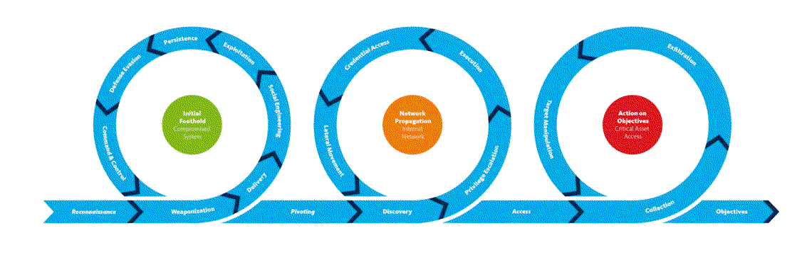

# Unified kill chain

| 
|:--:|
| Empire’s capabilities and infrastructure, as well as the dependencies or tactics that enable them. |

A more comprehensive approach combines elements from both the [Cyber kill chain](ckc.md) and the 
[MITRE ATT&CK kill chain](mitre.md), dividing an attack into 18 stages: Everything from reconnaissance to 
data exfiltration and understanding an attacker's motive. 
 
By using these two frameworks and comparing IOCs simultaneously against several feeds of reliable threat intel, it 
helps to know whether a threat needs attention or not. Both defenders and red teams can use a unified kill chain 
attack model to help develop and improve defensive controls.

## Resources

* [The Unified Kill Chain](https://unifiedkillchain.com/)