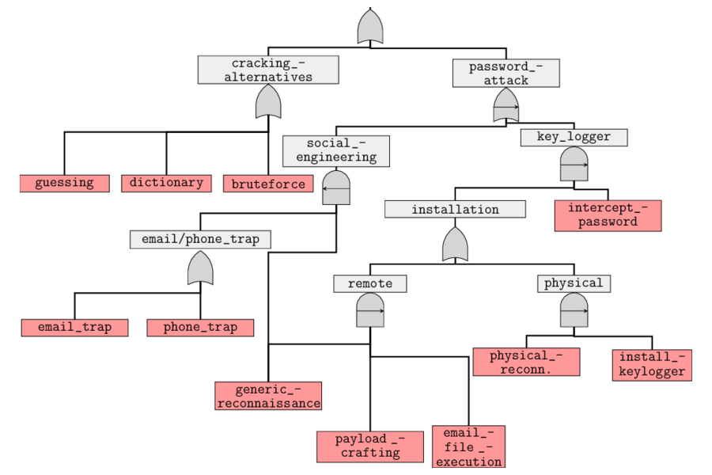

# Attack trees

Attack trees are the conceptual diagram showing how an asset, or target, might be attacked. These are multi-level 
diagrams consisting of one root node, leaves, and children nodes. Bottom to Top, child nodes are conditions that must 
be satisfied to make the direct parent node true. An attack is considered complete when the root is satisfied. 
Each node may be satisfied only by its direct child nodes. 

| 
|:--:|
| Attack on a password. Credit: Rajesh Kumar|

Suppose there is 1 grandchild below the root node. In such a case multiple steps must be taken to carry out an attack 
as first the grandchild’s conditions must be satisfied for the direct parent node to be true and then the direct parent 
node condition must be satisfied to make the root node true. It also has `AND` and `OR` options which represent 
alternatives and different steps towards achieving that goal.

Commercial Tools like SecurITree, AttackTree+ and opensource tools like ADTool, Ent, and SeaMonster can be used to model 
attack trees. And since this is just about drawing boxes, a simple drawing tool will do. Also, writing out the tree 
in lists is very common and can suffice. 
