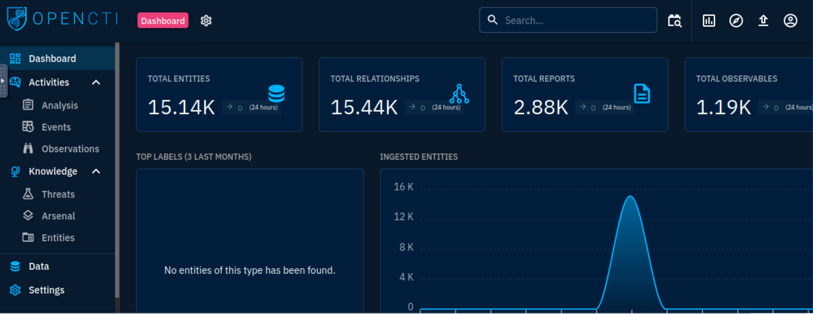

# Dashboard

| 
|:--:|
| The opening dashboard shows visual widgets summarising the threat data ingested into OpenCTI. |

The OpenCTI categorises and presents entities under the Activities and Knowledge groups on the left-side panel. 

## Activities

The activities section covers security incidents ingested onto the platform in the form of reports. It makes it easy for 
analysts to investigate these incidents. 

### Analysis

The Analysis tab contains the input entities in reports analysed and associated external references. Reports are 
central to OpenCTI as knowledge on threats and events are extracted and processed. They allow for easier identification 
of the source of information by analysts. Additionally, analysts can add their investigation notes and other external 
resources for knowledge enrichment. 

### Events

Security analysts investigate and hunt for events involving suspicious and malicious activities across their 
organisational network. Within the Events tab, analysts can record their findings and enrich their threat intel by 
creating associations for their incidents.

### Observations

Technical elements, detection rules and artefacts identified during a cyberattack are listed under this tab: one or 
several identifiable makeup indicators. These elements assist analysts in mapping out threat events during a hunt and 
perform correlations between what they observe in their environments against the intel feeds.

## Knowledge

The Knowledge section provides linked data related to the tools adversaries use, targeted victims and the type of 
threat actors and campaigns used.

### Threats

All information classified as threatening to an organisation or information would be classified under threats:

* Threat Actors: An individual or group of attackers seeking to propagate malicious actions against a target.
* Intrusion Sets: An array of TTPs, tools, malware and infrastructure used by a threat actor against targets who 
share some attributes. APTs and threat groups are listed under this category on the platform due to their known 
pattern of actions.
* Campaigns: Series of attacks taking place within a given period and against specific victims initiated by advanced 
persistent threat actors who employ various TTPs. Campaigns usually have specified objectives and are orchestrated 
by threat actors from a nation state, crime syndicate or other disreputable organisation.

### Arsenal

This tab lists all items related to an attack and any legitimate tools identified from the entities.

* Malware: Known and active malware and trojan are listed with details of their identification and mapping based on 
the knowledge ingested into the platform. For example, we can analyse the 4H RAT malware, and extract information and 
associations made about the malware.
* Attack Patterns: Adversaries implement and use different TTPs to target, compromise, and achieve their objectives. 
We can look at the details of the Command-Line Interface and make decisions based on the relationships established on 
the platform and navigate through an investigation associated with the technique.
* Courses of Action: MITRE maps out concepts and technologies that can be used to prevent an attack technique from 
being employed successfully. These are represented as Courses of Action (CoA) against the TTPs.
* Tools: Lists all legitimate tools and services developed for network maintenance, monitoring and management. 
Adversaries may also use these tools to achieve their objectives. For example, for the Command-Line Interface attack 
pattern, it is possible to narrow down that CMD would be used as an execution tool. As an analyst, one can 
investigate reports and instances associated with the use of the tool.
* Vulnerabilities: Known software bugs, system weaknesses and exposures are listed to provide enrichment for what 
attackers may use to exploit and gain access to systems. The Common Vulnerabilities and Exposures (CVE) list 
maintained by MITRE is used and imported via a connector.

### Entities

This tab categorises all entities based on operational sectors, countries, organisations and individuals. This 
information allows for knowledge enrichment on attacks, organisations or intrusion sets.
