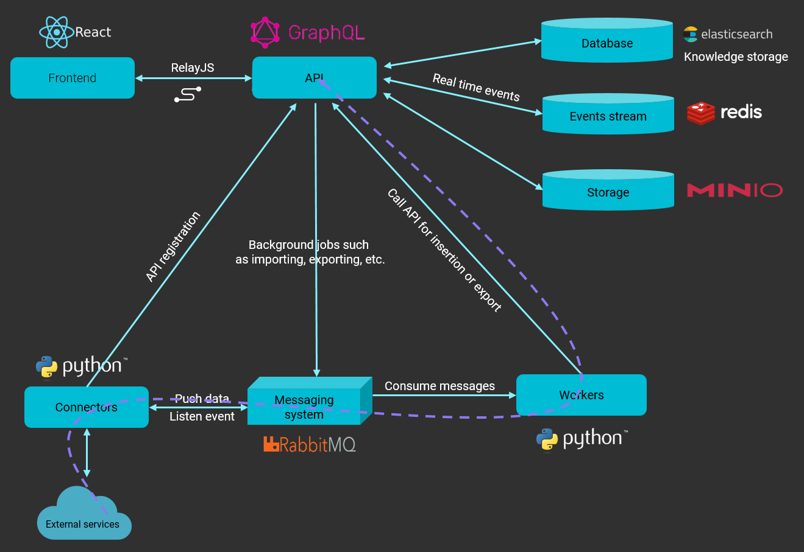

# Data model

OpenCTI uses a variety of knowledge schemas in structuring data, the main one being the Structured Threat Information 
Expression (STIX2) standards. STIX is a serialised and standardised language format used in threat intelligence 
exchange. It allows for the data to be implemented as entities and relationships, effectively tracing the origin of 
the provided information.

| 
|:--:|
| The [data model](https://filigran.notion.site/Data-model-4427344d93a74fe194d5a52ce4a41a8d) is supported by the platform's architecture. Source: [OpenCTI Public Knowledge Base](https://filigran.notion.site/OpenCTI-Public-Knowledge-Base-d411e5e477734c59887dad3649f20518) |

## Services

* GraphQL API: The API connects clients to the database and the messaging system.
* Write workers: Python processes utilised to write queries asynchronously from the RabbitMQ messaging system.
* Connectors: Another set of python processes used to ingest, enrich or export data on the platform. These connectors 
provide the application with a network of integrated systems and frameworks to create threat intelligence relations 
and allow users to improve their defence tactics.

## Connectors

| Class                          | Description                                                  | Examples                  |
|:-------------------------------|:-------------------------------------------------------------|:--------------------------|
| External Input Connector       | Ingests information from external sources                    | CVE, MISP, TheHive, MITRE |
| Stream Connector               | Consumes platform data stream                                | History, Tanium           |
| Internal Enrichment Connector  | Takes in new OpenCTI entities from user requests             | Observables enrichment    |
| Internal Import File Connector | Extracts information from uploaded reports                   | PDFs, STIX2 Import        |
| Internal Export File Connector | Exports information from OpenCTI into different file formats | CSV, STIX2 export, PDF    |

## Resources

* [We are Filigran, the new home for OpenCTI and OpenEx](https://medium.com/filigran/we-are-filigran-the-new-home-for-opencti-and-openex-b613ba9c7f99)
* [OpenCTI Public Knowledge Base](https://filigran.notion.site/OpenCTI-Public-Knowledge-Base-d411e5e477734c59887dad3649f20518)
* [OpenCTI Demo](https://demo.opencti.io/dashboard)
* [OpenCTI-Platform on GitHub](https://github.com/OpenCTI-Platform)
* [OpenCTI data model](https://filigran.notion.site/Data-model-4427344d93a74fe194d5a52ce4a41a8d)
* [OpenCTI connectors](https://github.com/OpenCTI-Platform/connectors)

